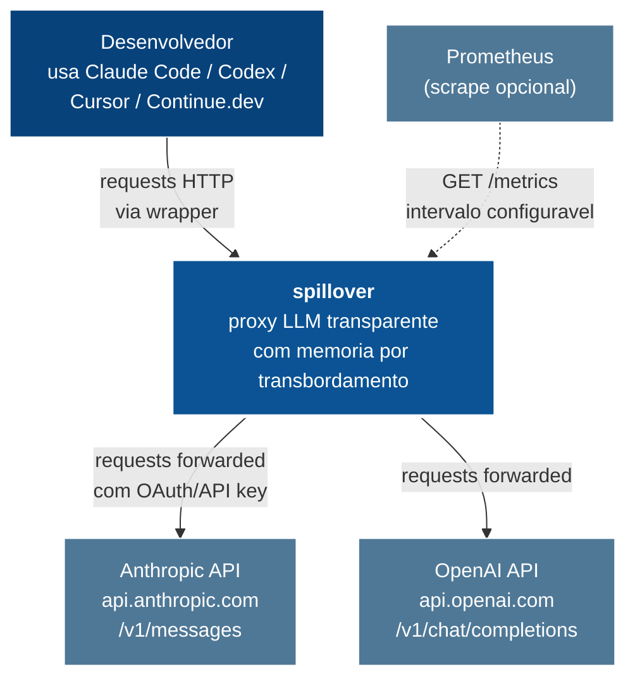

# 01 — Contexto do Sistema (C4 Nivel 1)

spillover fica no meio do caminho entre qualquer cliente de API LLM e o provider upstream, interceptando todas as requisicoes pra externalizar contexto que transborda e injetar episodios passados relevantes.

## Atores

| ator | papel |
|---|---|
| Desenvolvedor | invoca spillover via wrapper ou seta `ANTHROPIC_BASE_URL` manualmente |
| Anthropic API | provider LLM upstream; spillover encaminha o trafego |
| OpenAI API | segundo provider suportado |
| Prometheus | faz scrape de `/metrics` em qualquer intervalo escolhido |

## O que spillover possui

1. Daemon HTTP em loopback na porta `:8787` (porta configuravel).
2. Stores de memoria por projeto em `~/.spillover/projects/<sha1(cwd)>/`.
3. Wrappers que lancam cada CLI suportada com spillover ja conectado.
4. Defesas counter-compaction aplicadas transparentemente a todo trafego forwarded.

## O que spillover NAO possui

- Nenhuma infra de cloud. Tudo roda local na workstation do dev.
- Autenticacao. spillover encaminha o header de auth que o cliente envia (Bearer OAuth ou key `sk-ant-…`).
- A API do provider em si. spillover e passthrough transparente por padrao.
