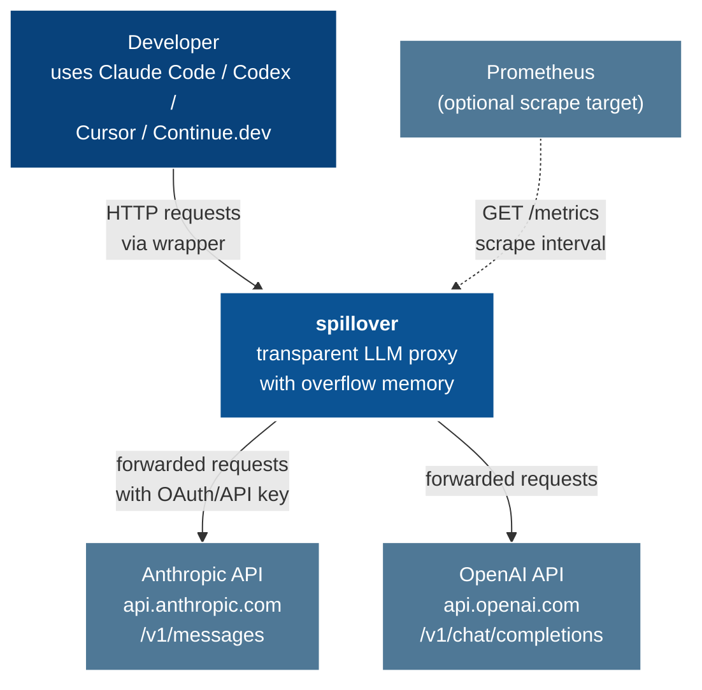

# 01 — System Context (C4 Level 1)

Spillover sits between any LLM-API client and the upstream provider, intercepting every request to externalise overflow context and inject relevant past episodes.

## Actors

| actor | role |
|---|---|
| Developer | invokes spillover via wrapper or sets `ANTHROPIC_BASE_URL` manually |
| Anthropic API | upstream LLM provider; spillover forwards traffic |
| OpenAI API | second supported upstream |
| Prometheus | scrapes `/metrics` at any chosen interval |

## What spillover owns

1. The HTTP loopback proxy daemon at `:8787` (port configurable).
2. Per-project memory stores under `~/.spillover/projects/<sha1(cwd)>/`.
3. The wrappers that launch each supported CLI with spillover wired in.
4. Counter-compaction defenses applied transparently to all forwarded requests.

## What spillover does not own

- Any cloud infrastructure. Everything runs locally on the developer's workstation.
- Authentication. Spillover forwards whatever auth header the client provides (OAuth bearer or `sk-ant-…` API key).
- The provider API itself. Spillover is a transparent passthrough by default.
