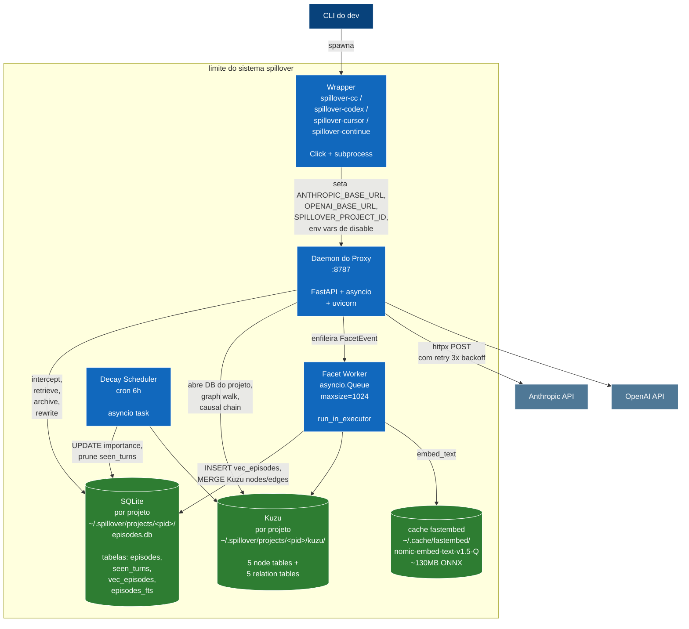

# 02 — Containers (C4 Nivel 2)

Dentro do limite do sistema spillover: 4 containers de runtime + 3 stores persistentes.

## Containers de runtime

| container | tech | tempo de vida | proposito |
|---|---|---|---|
| Wrapper | Click + subprocess | curto — termina junto com o CLI alvo | seta env vars, lanca CLI |
| Daemon do Proxy | FastAPI + asyncio + uvicorn | longo — 1 processo por maquina | rotas HTTP pra todo trafego forwarded + query ad-hoc |
| Facet Worker | consumidor de asyncio.Queue | vida do proxy | ingestao async dos episodios evicted em embeddings + graph |
| Decay Scheduler | task cron asyncio | vida do proxy | a cada 6h ajusta importance + faz prune de seen_turns velhos |

## Stores persistentes

| store | tech | localizacao | escopo |
|---|---|---|---|
| SQLite | sqlite3 stdlib + sqlite-vec + FTS5 | `~/.spillover/projects/<pid>/episodes.db` | um arquivo por projeto |
| Kuzu | DB de grafo embedded | `~/.spillover/projects/<pid>/kuzu/` | um DB por projeto, cache LRU 32 |
| cache fastembed | modelo ONNX | `~/.cache/fastembed/` | compartilhado entre todos os projetos da maquina |

## Fluxos principais

- **Request inbound**: Wrapper → Proxy → SQLite + Kuzu (leitura) → Anthropic/OpenAI → SQLite (escrita do evicted) → fila do FacetWorker.
- **Pipeline async de facet**: FacetWorker pop → fastembed + classify + extract → SQLite (vec_episodes + fts) + Kuzu (nodes/edges).
- **Sweep do decay**: Scheduler tick → percorre vec_episodes por projeto → UPDATE importance, prune seen_turns velhos.

## Modelo de processo

Um unico processo `spillover up` hospeda proxy + facet worker + decay scheduler no mesmo event loop asyncio. Trabalho CPU-bound (inferencia fastembed, escritas SQLite durante eviction) passa por `loop.run_in_executor` pra o hot path nao bloquear.

## Fronteira de escala

spillover e **single-machine, single-process** por design. Pra deploy multi-tenant SaaS, o schema ja carrega `project_id` (denormalizado em `episodes`), mas o layout de arquivo-por-projeto precisaria consolidar num DB escopado por tenant. Ver [follow-ups do Plan 10](../superpowers/plans/2026-05-21-spillover-plan10-vision-complete.md) pro caminho.
