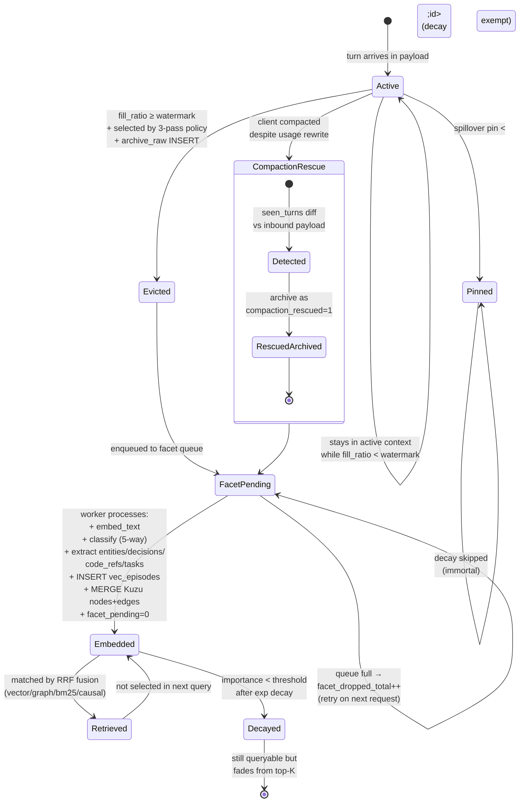

# 05 — Episode lifecycle

State machine for a single conversation turn from the moment it arrives in a request until it fades from retrieval relevance.



## States

| state | meaning | DB markers |
|---|---|---|
| Active | in the inbound conversation's `messages[]` | not yet in `episodes` table |
| Pinned | active OR archived but exempt from decay | `episodes.pinned = 1` |
| Evicted | removed from active context, raw content preserved | `episodes.evicted = 1, facet_pending = 1` |
| FacetPending | archived but not yet indexed | `episodes.facet_pending = 1` |
| Embedded | facet pipeline complete; queryable | `episodes.facet_pending = 0` + `vec_episodes` row + `episodes_fts` row + Kuzu nodes |
| Retrieved | currently included in an active LTM block | transient — not a persisted state |
| Decayed | low importance; rarely chosen by RRF | `vec_episodes.importance` < threshold |
| RescuedArchived | rescued from a client-side compaction | `episodes.compaction_rescued = 1` |

## Transitions

| from | to | trigger |
|---|---|---|
| `Active` | `Evicted` | watermark crossed + selector picked + archive_raw succeeded |
| `Active` | `Pinned` | `spillover pin <id>` (CLI placeholder; programmatic UPDATE supported now) |
| `Active` | `CompactionRescue` | inbound payload lost a turn we previously saw |
| `Evicted` | `FacetPending` | enqueued to `asyncio.Queue` |
| `FacetPending` | `Embedded` | facet worker processed event |
| `Embedded` | `Retrieved` | matched by RRF fusion this turn |
| `Embedded` | `Decayed` | exp decay reduced importance below threshold |
| `Pinned` | `Pinned` (self) | decay scheduler skips pinned rows |

## Decay formula

```
importance = base_for_type × exp(-age_hours / half_life_for_type)
           + min(hit_count × 0.05, 0.5)
```

| type | base | half_life |
|---|---:|---:|
| priority | 1.0 | 60 days |
| task | 0.95 | 90 days |
| procedural | 0.7 | 30 days |
| semantic | 0.6 | 14 days |
| episodic | 0.5 | 7 days |

## Storage path per state

```
Active           → in-flight payload (not persisted by spillover)
Evicted          → episodes(content_json) + episodes_fts(body)
FacetPending     → same row, facet_pending=1
Embedded         → + vec_episodes(embedding, importance) + Kuzu nodes/edges
RescuedArchived  → episodes(compaction_rescued=1)
Decayed          → same row, lower importance
Pinned           → episodes(pinned=1), unchanged by decay
```
