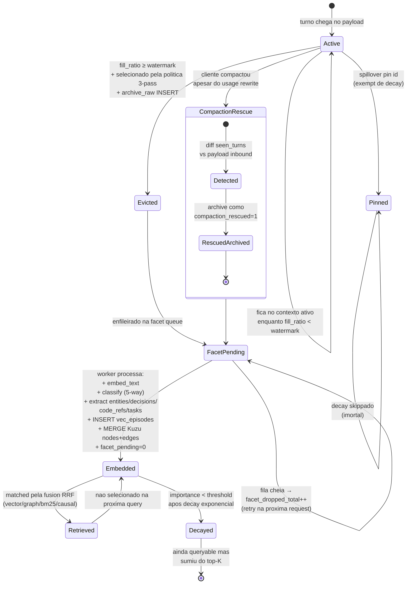

# 05 — Ciclo de vida do Episodio

Maquina de estados de um unico turno de conversa, desde o momento em que chega numa request ate sumir da relevancia pro retrieval.



## Estados

| estado | significado | marcadores no DB |
|---|---|---|
| Active | no `messages[]` da conversa inbound | ainda nao na tabela `episodes` |
| Pinned | ativo OU arquivado mas exempt de decay | `episodes.pinned = 1` |
| Evicted | removido do contexto ativo, conteudo raw preservado | `episodes.evicted = 1, facet_pending = 1` |
| FacetPending | arquivado mas ainda nao indexado | `episodes.facet_pending = 1` |
| Embedded | pipeline de facet completo; queryable | `episodes.facet_pending = 0` + linha `vec_episodes` + linha `episodes_fts` + nodes Kuzu |
| Retrieved | incluido no LTM block atual | transiente — nao e estado persistido |
| Decayed | importance baixa; raramente escolhido pela RRF | `vec_episodes.importance` < threshold |
| RescuedArchived | resgatado de uma compaction client-side | `episodes.compaction_rescued = 1` |

## Transicoes

| de | pra | trigger |
|---|---|---|
| `Active` | `Evicted` | watermark cruzado + selector escolheu + archive_raw succeeded |
| `Active` | `Pinned` | `spillover pin <id>` (placeholder de CLI; UPDATE programatico ja suporta) |
| `Active` | `CompactionRescue` | payload inbound perdeu um turno que vimos antes |
| `Evicted` | `FacetPending` | enfileirado em `asyncio.Queue` |
| `FacetPending` | `Embedded` | facet worker processou o evento |
| `Embedded` | `Retrieved` | matched pela fusion RRF nesta turn |
| `Embedded` | `Decayed` | decay exp reduziu importance abaixo do threshold |
| `Pinned` | `Pinned` (self) | decay scheduler pula linhas pinned |

## Formula do decay

```
importance = base_pro_tipo × exp(-age_hours / half_life_pro_tipo)
           + min(hit_count × 0.05, 0.5)
```

| tipo | base | half_life |
|---|---:|---:|
| priority | 1.0 | 60 dias |
| task | 0.95 | 90 dias |
| procedural | 0.7 | 30 dias |
| semantic | 0.6 | 14 dias |
| episodic | 0.5 | 7 dias |

## Path de storage por estado

```
Active           → no payload em flight (nao persistido pelo spillover)
Evicted          → episodes(content_json) + episodes_fts(body)
FacetPending     → mesma linha, facet_pending=1
Embedded         → + vec_episodes(embedding, importance) + Kuzu nodes/edges
RescuedArchived  → episodes(compaction_rescued=1)
Decayed          → mesma linha, importance menor
Pinned           → episodes(pinned=1), inalterado pelo decay
```
