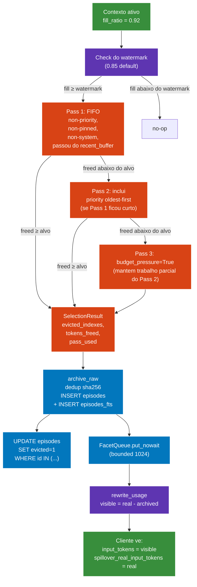

# 06 — Fluxo de Eviction (token-balanced 1:1)

Quando a janela ativa passa do watermark, spillover faz eviction dos tokens mais antigos numa proporcao 1:1 contra os que estao entrando — nunca compactando, nunca resumindo.



## Trigger

Eviction soh dispara quando:

```
fill_ratio = (input_tokens + output_tokens) / operational_ceiling_tokens
fill_ratio >= watermark   # default 0.85
```

`operational_ceiling_tokens` e o **teto soft** (ex: 200k ou 30k pro heavy bench). Pode ser setado bem abaixo do teto hard do provider (1 M no Opus) pra deixar folga e evitar degradacao de atencao.

## Calculo do budget

```
tokens_to_free = new_user_tokens + new_assistant_tokens
```

Eviction libera tantos tokens quanto o turno novo introduz — mantendo a janela ativa estavel no watermark.

## Politica 3-pass

| pass | filtro | racional |
|---|---|---|
| 1 (FIFO) | exclui system, pinned, tipo priority, ultimos `recent_buffer` turnos | preserva contexto recente + categorias protegidas |
| 2 (fallback priority) | drena non-priority primeiro, depois priority oldest-first | so sacrifica priority quando nao tem outra opcao |
| 3 (budget pressure) | mantem trabalho parcial do Pass 2, sinaliza `budget_pressure=True` | best-effort; caller pode encolher budget de LTM |

Opcao weighted-FIFO (Plan 5): `weight = token_count / max(1, density)` onde density = entity + decision + tool-call count. Turnos com menor density sao evictados primeiro, mesmo se mais novos. Ativa soh quando algum candidato tem `density > 0`; senao FIFO puro preserva contratos de teste existentes.

## Contrato do archive

`archive_raw(db, turn)`:

1. `_hash_turn(turn)` → sha256 sobre role + content + tool_calls (NAO ts, NAO code_refs, NAO project_id).
2. Tenta `INSERT INTO episodes (...)` com `UNIQUE(hash)`.
3. Em `IntegrityError`: re-SELECT id existente; retorna ele (dedup race-safe).
4. Mesma linha recebe INSERT paralelo em `episodes_fts` (espelho FTS5).

## Usage rewrite (Vector 1 de counter-compaction)

Depois do eviction completar, o proxy reescreve o bloco `usage` upstream antes de retornar pro cliente:

```python
visible_input_tokens = real_input_tokens - tokens_archived_this_turn
```

Cliente ve input aparentemente menor e nao dispara sua politica propria de compaction. Numero original real preservado em `spillover_real_input_tokens` pra auditoria.

## Invariante de steady-state

Numa sessao indefinida:

```
tokens_added_per_turn == tokens_evicted_per_turn (steady state)
```

Janela ativa fica colada no teto. Memoria cresce so no lado do archive, nunca no contexto ativo.

## Observado (heavy bench)

| metrica | valor |
|---|---:|
| chars enviados ao proxy | 81,165 |
| real input_tokens pra Anthropic | 22,541 |
| visible input_tokens pro cliente | 22,320 |
| delta do usage rewrite | 221 |
| episodes archived (evictions disparadas) | 4 |
| pass de eviction usado | 1 (FIFO) |
| latencia da eviction | ~15 ms |
