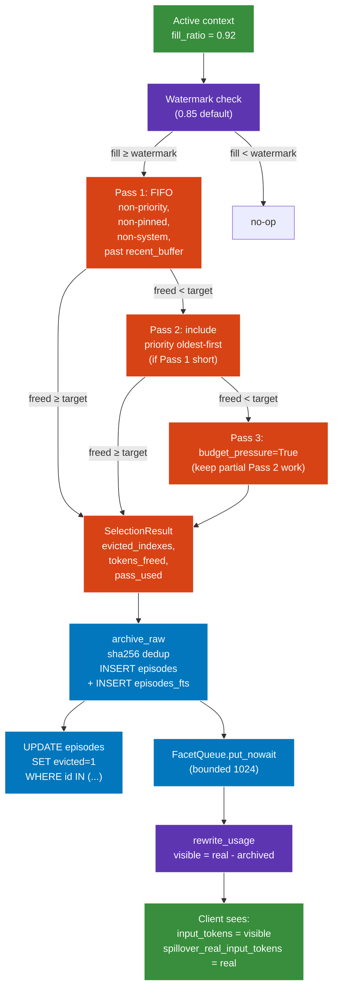

# 06 — Eviction flow (token-balanced 1:1)

When the active window crosses the watermark, spillover evicts oldest tokens 1:1 against the incoming ones — never compacting, never summarising.



## Trigger

Eviction fires only when:

```
fill_ratio = (input_tokens + output_tokens) / operational_ceiling_tokens
fill_ratio >= watermark   # default 0.85
```

`operational_ceiling_tokens` is the **soft ceiling** (e.g. 200k or 30k for the heavy bench). It can be set well below the provider's hard ceiling (1 M on Opus) to leave headroom and avoid attention degradation.

## Budget calculation

```
tokens_to_free = new_user_tokens + new_assistant_tokens
```

The eviction frees as many tokens as the new turn introduces — keeping the active window steady at or near the watermark.

## 3-pass policy

| pass | filter | rationale |
|---|---|---|
| 1 (FIFO) | exclude system, pinned, priority-type, last `recent_buffer` turns | preserves recent context + protected categories |
| 2 (priority fallback) | drain non-priority first, then priority oldest-first | only sacrifices priority when no other choice |
| 3 (budget pressure) | keep partial Pass 2 work, signal `budget_pressure=True` | best-effort; caller can shrink LTM budget |

Weighted-FIFO option (Plan 5): `weight = token_count / max(1, density)` where density = entity + decision + tool-call count. Lower-density turns evicted first, even if newer. Activates only when any candidate has `density > 0`; otherwise pure FIFO preserves existing test contracts.

## Archive contract

`archive_raw(db, turn)`:

1. `_hash_turn(turn)` → sha256 over role + content + tool_calls (NOT ts, NOT code_refs, NOT project_id).
2. Try `INSERT INTO episodes (...)` with `UNIQUE(hash)`.
3. On `IntegrityError`: re-SELECT existing id; return it (race-safe dedup).
4. Same row gets a parallel INSERT into `episodes_fts` (FTS5 mirror).

## Usage rewrite (counter-compaction Vector 1)

After eviction completes, the proxy rewrites the upstream `usage` block before returning to the client:

```python
visible_input_tokens = real_input_tokens - tokens_archived_this_turn
```

The client sees a smaller-looking input and does not trigger its own compaction policy. The original real number is preserved in `spillover_real_input_tokens` for audit.

## Steady-state invariant

Over an indefinite session:

```
tokens_added_per_turn == tokens_evicted_per_turn (steady state)
```

Active window stays glued to the ceiling. Memory grows only on the archive side, never in active context.

## Observed (heavy bench)

| metric | value |
|---|---:|
| chars sent to proxy | 81,165 |
| real input_tokens to Anthropic | 22,541 |
| visible input_tokens to client | 22,320 |
| usage rewrite delta | 221 |
| episodes archived (evictions fired) | 4 |
| eviction pass used | 1 (FIFO) |
| eviction latency | ~15 ms |
