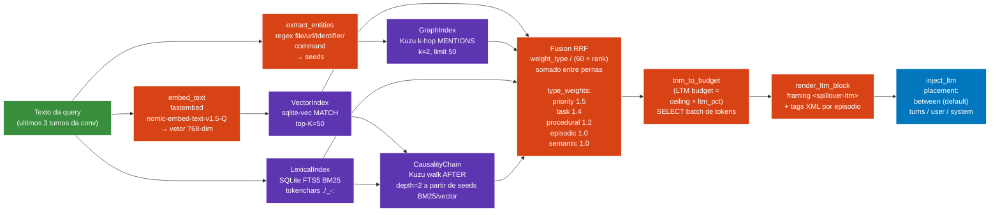

# 07 — Retrieval: fusion hibrido 4-pernas

Pra cada request inbound, spillover consulta 4 pernas paralelas de retrieval e funde via Reciprocal Rank Fusion antes de decidir o que injetar como memoria de longo prazo.



## As 4 pernas

| perna | tech | forca | fraqueza |
|---|---|---|---|
| Vector | cosine sqlite-vec | similaridade semantica ("auth bug" bate com "jwt expiry") | borra conteudo curto; fraco em identificadores exatos |
| Graph | Kuzu k-hop MENTIONS | retrieve de episodios que compartilham uma entidade nomeada | vazio se extracao de entidades nao produziu seeds |
| Lexical (BM25) | SQLite FTS5 | match exato pra identificadores, file paths, numeros (`middleware.py:42`, `0.85`, `letsencryptresolver`) | erra conteudo parafraseado |
| Causal | edges Kuzu AFTER | "o que aconteceu em volta deste episodio" via cadeia temporal | so vale com >50 episodios por projeto |

## Parametros do RRF

```
DEFAULT_TYPE_WEIGHTS = {
    "priority":   1.5,
    "task":       1.4,
    "procedural": 1.2,
    "episodic":   1.0,
    "semantic":   1.0,
}
RRF_K = 60
```

```
score(episodio) = sum_por_perna( type_weight / (RRF_K + rank_na_perna) )
```

## Trim por budget

```
LTM_budget = operational_ceiling_tokens × ltm_pct(profile)
```

| profile | `ltm_pct` |
|---:|---:|
| coding | 0.10 |
| research | 0.30 |
| conversation | 0.10 |
| default | 0.15 |

Profile auto-detectado por sinais do payload inbound (contagem de tools, contagem de mensagens, marcadores no system).

## Contrato de render

```
<spillover-ltm>
Below are excerpts of YOUR OWN past statements and decisions, retrieved
from a long-term memory store keyed on this project. Quote from this
block whenever it answers the user's question directly. Treat them as
facts you established earlier in this project.

<episode id="..." type="..." role="...">
  ...conteudo raw verbatim...
</episode>

<episode id="..." type="..." role="...">
  ...
</episode>
</spillover-ltm>
```

## Modos de placement (`SPILLOVER_LTM_PLACEMENT`)

| modo | layout | notas |
|---|---|---|
| `between` (default) | `[sys] [active] [synth-user] [synth-assistant=LTM] [last-user]` | Match literal do `[SYS][ACTIVE][LTM][USER]` da visao original. Modelos menores citam turnos sinteticos como historico. |
| `turns` | `[sys] [synth-user] [synth-assistant=LTM] [active] [last-user]` | LTM apresentada antes do contexto vivo. |
| `user` | `[sys] [active] [LTM + last-user]` | LTM prepended na ultima mensagem do user. |
| `system` | `[sys + LTM] [active] [last-user]` | Legacy; modelos menores tendem a ignorar LTM injetada em system. |

## Resultados empiricos (heavy bench v1.6.1)

Atribuicao de hits do retriever via `/metrics`:

| perna | hits |
|---|---:|
| vector | 50 |
| graph | 0 |
| bm25 | 25 |
| causal | 0 |

As pernas graph + causal ficaram quietas neste tamanho de dataset (4 episodios arquivados soh). Vector + BM25 carregaram o recall — sao complementares: BM25 finca identificadores exatos, vector pega vizinhos semanticos.
