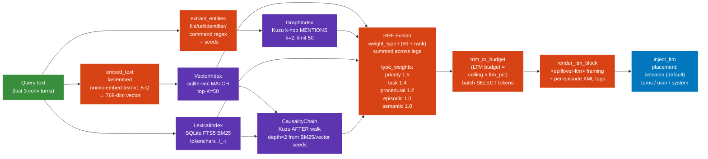

# 07 — Retrieval: 4-leg hybrid fusion

For every inbound request, spillover queries four parallel retrieval legs and fuses them via Reciprocal Rank Fusion before deciding what to inject as long-term memory.



## The four legs

| leg | tech | strength | weakness |
|---|---|---|---|
| Vector | sqlite-vec cosine | semantic similarity ("auth bug" matches "jwt expiry") | smears short content; weak on exact identifiers |
| Graph | Kuzu k-hop MENTIONS | retrieves episodes that share a named entity | empty if entity extraction produced no seeds |
| Lexical (BM25) | SQLite FTS5 | exact-match for identifiers, file paths, numbers (`middleware.py:42`, `0.85`, `letsencryptresolver`) | misses paraphrased content |
| Causal | Kuzu AFTER edges | "what happened around this episode" via temporal chain | only valuable at >50 episodes per project |

## RRF parameters

```
DEFAULT_TYPE_WEIGHTS = {
    "priority":   1.5,
    "task":       1.4,
    "procedural": 1.2,
    "episodic":   1.0,
    "semantic":   1.0,
}
RRF_K = 60
```

```
score(episode) = sum_over_legs( type_weight / (RRF_K + rank_in_leg) )
```

## Budget trim

```
LTM_budget = operational_ceiling_tokens × ltm_pct(profile)
```

| profile | `ltm_pct` |
|---:|---:|
| coding | 0.10 |
| research | 0.30 |
| conversation | 0.10 |
| default | 0.15 |

Profile auto-detected from inbound payload signals (tool count, message count, system markers).

## Render contract

```
<spillover-ltm>
Below are excerpts of YOUR OWN past statements and decisions, retrieved
from a long-term memory store keyed on this project. Quote from this
block whenever it answers the user's question directly. Treat them as
facts you established earlier in this project.

<episode id="..." type="..." role="...">
  ...verbatim raw content...
</episode>

<episode id="..." type="..." role="...">
  ...
</episode>
</spillover-ltm>
```

## Placement modes (`SPILLOVER_LTM_PLACEMENT`)

| mode | layout | notes |
|---|---|---|
| `between` (default) | `[sys] [active] [synth-user] [synth-assistant=LTM] [last-user]` | Matches the literal `[SYS][ACTIVE][LTM][USER]` from the original design vision. Smaller models cite from synthetic prior turns. |
| `turns` | `[sys] [synth-user] [synth-assistant=LTM] [active] [last-user]` | LTM presented before the live context. |
| `user` | `[sys] [active] [LTM + last-user]` | LTM prepended to the latest user message. |
| `system` | `[sys + LTM] [active] [last-user]` | Legacy; smaller models tend to ignore system-injected LTM. |

## Empirical results (heavy bench v1.6.1)

Retriever hits attribution from `/metrics`:

| leg | hits |
|---|---:|
| vector | 50 |
| graph | 0 |
| bm25 | 25 |
| causal | 0 |

The graph + causal legs were quiet at this dataset size (4 archived episodes only). Vector + BM25 carried recall — they complement each other: BM25 nails exact identifiers, vector catches semantic neighbours.
