# 08 — Counter-compaction: defesa em 4 vetores

CLIs auto-compactam quando percebem pressao de contexto. spillover aplica 4 defesas independentes pra que a conversa nunca seja resumida, importa qual trigger o CLI tentar.

```mermaid
flowchart TB
    classDef vec fill:#c62828,stroke:#fff,color:#fff
    classDef impl fill:#1565c0,stroke:#fff,color:#fff

    subgraph V1["Vetor 1: Usage Rewrite"]
        V1A["Apos resposta do provider<br/>real_input_tokens = 22541"]:::vec
        V1B["Subtrai tokens_archived<br/>(eviction deste turno)<br/>= 22320 visivel"]:::impl
        V1C["Cliente recebe usage spoofado<br/>usage.input_tokens = 22320<br/>+ spillover_real_input_tokens = 22541<br/>(campo de auditoria)"]:::impl
    end

    subgraph V2["Vetor 2: Disable via env-var"]
        V2A["Wrapper spawna CLI com:<br/>CLAUDE_CODE_AUTO_COMPACT=0<br/>CLAUDE_CODE_DISABLE_COMPACT=1<br/>CLAUDE_CODE_DISABLE_AUTO_COMPACT=1<br/>(mais equivalentes codex/cursor)"]:::vec
    end

    subgraph V3["Vetor 3: Diff + Resgate"]
        V3A["A cada request inbound,<br/>hashea cada turno assistente"]:::vec
        V3B["Compara contra tabela seen_turns<br/>(por projeto, sha256 ordenado)"]:::impl
        V3C["Se turnos sumiram<br/>(cliente compactou anyway):<br/>archive como compaction_rescued=1,<br/>enfileira facets,<br/>reinjeta no proximo LTM block"]:::impl
    end

    subgraph V4["Vetor 4: Intercept"]
        V4A["should_intercept_request<br/>pattern match contra<br/>prompts conhecidos de compaction<br/>(EN + PT-BR)"]:::vec
        V4B["Se bate: retorna 200 sintetico<br/>com texto assistant stub<br/>SEM encaminhar pro provider"]:::impl
    end

    V1A --> V1B --> V1C
    V2A
    V3A --> V3B --> V3C
    V4A --> V4B
```



## Vetor 1 — usage rewrite

**Onde:** toda resposta.
**Como:** subtrai `tokens_archived_this_turn` do `usage.input_tokens` antes de retornar pro cliente. Numero original preservado em `spillover_real_input_tokens`.

Variante streaming: o SSE rewrite espera o chunk `message_stop` / `message_delta`, reescreve seu campo `usage`, emite o chunk reescrito por ultimo. Chunks de conteudo passam vivos; soh o chunk com usage e buffered.

```python
visible.input_tokens = real.input_tokens - tokens_archived_this_turn
visible.spillover_real_input_tokens = real.input_tokens
```

**Efeito:** cliente acredita que seu budget de contexto esta mais saudavel que a realidade. Threshold de auto-compact (ex: 80% da janela) nunca cruzado.

## Vetor 2 — disable via env-var

**Onde:** script wrapper (`spillover-cc`, `spillover-codex`, etc).
**Como:** seta flags conhecidas via env vars antes de lancar o CLI alvo.

Patterns conhecidos:

| CLI | env vars setadas |
|---|---|
| Claude Code | `CLAUDE_CODE_AUTO_COMPACT=0`, `CLAUDE_CODE_DISABLE_COMPACT=1`, `CLAUDE_CODE_DISABLE_AUTO_COMPACT=1` |
| Codex | `CODEX_AUTO_COMPACT=0`, `CODEX_DISABLE_COMPACT=1` |
| Cursor | (flags Cursor-specific TBD; default cai em V1) |
| Continue.dev | (config por extensao; default cai em V1) |

**Efeito:** CLIs que respeitam essas env vars pulam compaction inteiro.

## Vetor 3 — diff de conversa + resgate

**Onde:** toda request inbound.
**Como:**

1. Hashea toda mensagem `role=assistant` no `messages[]` inbound.
2. Compara contra tabela `seen_turns` (por projeto, sha256-keyed).
3. Se turnos que vimos antes estao sumidos → cliente compactou eles.
4. Restaura o conteudo perdido do `seen_turns.content_json`, archive como `compaction_rescued=1`, enfileira facets pra que sejam indexados.
5. Proximo LTM block inclui eles via retrieval normal; agente le suas falas resgatadas de volta.

```python
seen_hashes = {hash(t) for t in seen_turns_for(project_id)}
inbound_hashes = {hash(m) for m in messages if m.role == "assistant"}
missing = seen_hashes - inbound_hashes
for m in resolve_from_seen_turns(missing):
    archive_raw(db, Turn(..., compaction_rescued=True))
    enqueue_facet(m.id)
```

**Efeito:** mesmo se V1 + V2 falharem e o CLI compactar anyway, os turnos perdidos sao recuperados automaticamente na proxima request. Sem perda de dado na pratica.

## Vetor 4 — intercept explicito

**Onde:** toda request inbound, antes de qualquer retrieval ou forwarding.
**Como:** pattern match contra prompts de compaction em ingles e portugues.

```python
patterns = [
    "compact the conversation",
    "summarize the conversation",
    "resume the conversation",
    "resuma a conversa",
    "compacte o histórico",
    # ...
]
```

Se o prompt inbound parece request de compaction, spillover **nao encaminha**. Retorna 200 sintetico com resposta generica de assistant (`"Conversation context preserved by spillover; no compaction needed."`). CLI acha que a request deu certo; spillover salvou a chamada.

**Efeito:** comandos explicitos de compaction sao neutralizados; zero token gasto no provider.

## Ordenacao das defesas

Cada vetor e independente e empilha:

1. V2 (disable via env) — mais preventivo; CLI nunca tenta compactar.
2. V4 (intercept) — pega invocacoes manuais de `/compact` independente de env vars.
3. V1 (usage rewrite) — cobre compaction automatica por threshold.
4. V3 (rescue) — recuperacao de ultimo recurso se tudo o mais falhou.

No trafego heavy-bench em producao, V1 + V3 carregaram a carga:

| metrica | valor |
|---|---:|
| compaction_detected_total | 1 (resgatou 6 turnos numa rodada) |
| episodes_archived_total{type="rescued"} | 6 |
| usage rewrite aplicado | toda resposta (visible = real − archived) |

## Auditabilidade

Campo de auditoria `spillover_real_input_tokens` do V1 no usage block da resposta permite que qualquer observer downstream reconcilie custo real. Flag `compaction_rescued=1` do V3 em `episodes` distingue conteudo resgatado de conteudo evictado natural. Requests interceptadas do V4 nao chegam no provider mas incrementam `requests_total{provider="anthropic", status="200"}` com campo `spillover_intercepted=true` no body pra rastreabilidade.
