# 08 — Counter-compaction: 4-vector defense

CLIs auto-compact when they perceive context pressure. Spillover applies four independent defenses so the conversation never gets summarised, no matter which trigger the CLI tries.

```mermaid
flowchart TB
    classDef vec fill:#c62828,stroke:#fff,color:#fff
    classDef impl fill:#1565c0,stroke:#fff,color:#fff

    subgraph V1["Vector 1: Usage Rewrite"]
        V1A["After provider response<br/>real_input_tokens = 22541"]:::vec
        V1B["Subtract tokens_archived<br/>(this turn's eviction)<br/>= 22320 visible"]:::impl
        V1C["Client receives spoofed<br/>usage.input_tokens = 22320<br/>+ spillover_real_input_tokens = 22541<br/>(audit field)"]:::impl
    end

    subgraph V2["Vector 2: Env-var Disable"]
        V2A["Wrapper spawns CLI with:<br/>CLAUDE_CODE_AUTO_COMPACT=0<br/>CLAUDE_CODE_DISABLE_COMPACT=1<br/>CLAUDE_CODE_DISABLE_AUTO_COMPACT=1<br/>(plus codex/cursor equivalents)"]:::vec
    end

    subgraph V3["Vector 3: Diff + Rescue"]
        V3A["On every inbound request,<br/>hash each assistant turn"]:::vec
        V3B["Compare against seen_turns table<br/>(per project, sha256 sorted)"]:::impl
        V3C["If turns disappeared<br/>(client compacted anyway):<br/>archive as compaction_rescued=1,<br/>enqueue facets,<br/>re-inject in next LTM block"]:::impl
    end

    subgraph V4["Vector 4: Intercept"]
        V4A["should_intercept_request<br/>pattern match against<br/>known compaction prompts<br/>(EN + PT-BR)"]:::vec
        V4B["If match: return synthetic<br/>200 with stub assistant text<br/>WITHOUT forwarding to provider"]:::impl
    end

    V1A --> V1B --> V1C
    V2A
    V3A --> V3B --> V3C
    V4A --> V4B
```



## Vector 1 — usage rewrite

**Where:** every response.
**How:** subtract `tokens_archived_this_turn` from `usage.input_tokens` before returning to client. Original number preserved as `spillover_real_input_tokens`.

Streaming variant: the SSE rewrite waits for the `message_stop` / `message_delta` chunk, rewrites its `usage` field, emits the rewritten chunk last. Content chunks stream live; only the usage chunk is buffered.

```python
visible.input_tokens = real.input_tokens - tokens_archived_this_turn
visible.spillover_real_input_tokens = real.input_tokens
```

**Effect:** client believes its context budget is healthier than reality. Auto-compact threshold (e.g. 80% of window) is never crossed.

## Vector 2 — env-var disable

**Where:** the wrapper script (`spillover-cc`, `spillover-codex`, etc).
**How:** sets known CLI flags via env vars before spawning the target CLI.

Known patterns:

| CLI | env vars set |
|---|---|
| Claude Code | `CLAUDE_CODE_AUTO_COMPACT=0`, `CLAUDE_CODE_DISABLE_COMPACT=1`, `CLAUDE_CODE_DISABLE_AUTO_COMPACT=1` |
| Codex | `CODEX_AUTO_COMPACT=0`, `CODEX_DISABLE_COMPACT=1` |
| Cursor | (Cursor-specific flags TBD; defaults to relying on V1) |
| Continue.dev | (per-extension config; defaults to relying on V1) |

**Effect:** CLIs that respect these env vars skip compaction entirely.

## Vector 3 — conversation diff + rescue

**Where:** every inbound request.
**How:**

1. Hash every `role=assistant` message in the inbound `messages[]`.
2. Compare against the `seen_turns` table (per project, sha256-keyed).
3. If turns we previously saw are now missing → client compacted them away.
4. Restore the missing content from `seen_turns.content_json`, archive as `compaction_rescued=1`, enqueue facets so they're indexed.
5. The next LTM block includes them via normal retrieval; the agent reads its rescued statements back.

```python
seen_hashes = {hash(t) for t in seen_turns_for(project_id)}
inbound_hashes = {hash(m) for m in messages if m.role == "assistant"}
missing = seen_hashes - inbound_hashes
for m in resolve_from_seen_turns(missing):
    archive_raw(db, Turn(..., compaction_rescued=True))
    enqueue_facet(m.id)
```

**Effect:** even if V1 + V2 fail and the CLI compacts anyway, the lost turns are recovered automatically on the next request. No data loss in practice.

## Vector 4 — explicit intercept

**Where:** every inbound request, before any retrieval or forwarding.
**How:** pattern match against compaction prompts in English and Portuguese.

```python
patterns = [
    "compact the conversation",
    "summarize the conversation",
    "resume the conversation",
    "resuma a conversa",
    "compacte o histórico",
    # ...
]
```

If the inbound prompt looks like a compaction request, spillover **does not forward**. It returns a synthetic 200 with a generic assistant response (`"Conversation context preserved by spillover; no compaction needed."`). The CLI thinks the request succeeded; spillover saved the call.

**Effect:** explicit compaction commands are neutralised; no provider tokens spent.

## Defense ordering

Each vector is independent and stacks:

1. V2 (env disable) — most preventive; CLI never tries to compact.
2. V4 (intercept) — catches manual `/compact` invocations regardless of env vars.
3. V1 (usage rewrite) — covers automatic threshold-driven compaction.
4. V3 (rescue) — last-resort recovery if everything else failed.

In production heavy-bench traffic, V1 + V3 carried the load:

| metric | value |
|---|---:|
| compaction_detected_total | 1 (rescued 6 turns in one round) |
| episodes_archived_total{type="rescued"} | 6 |
| usage rewrite applied | every response (visible = real − archived) |

## Auditability

V1's `spillover_real_input_tokens` audit field on the response usage block lets any downstream observer reconcile real cost. V3's `compaction_rescued=1` flag on `episodes` distinguishes rescued content from naturally-evicted content. V4's intercepted requests don't reach the provider but do increment `requests_total{provider="anthropic", status="200"}` with a `spillover_intercepted=true` field on the body for traceability.
