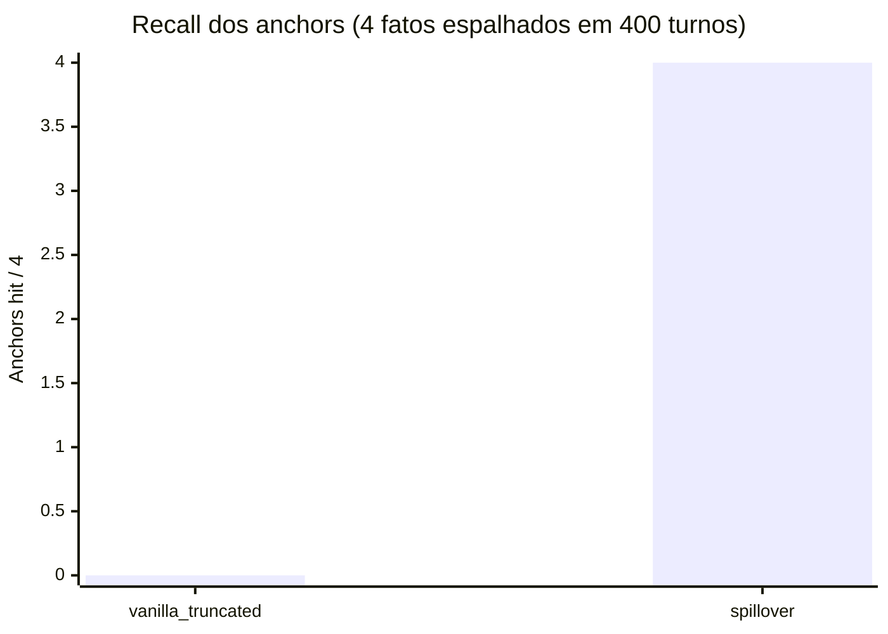
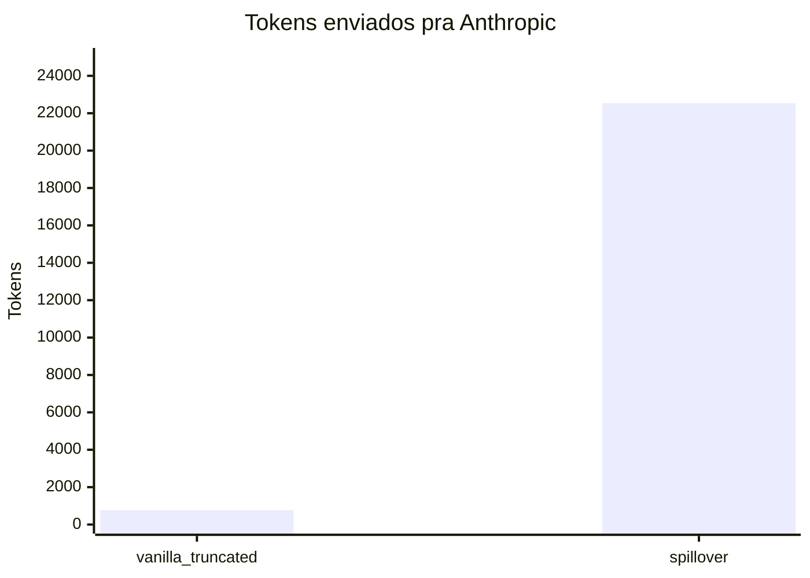

# 10 — Performance: heavy-stress bench (v1.6.1)

Trafego real Anthropic Haiku 4.5, 400 turnos de conversa de engenharia sintetica (~80 k chars / ~22 k tokens Anthropic), 4 fatos ancorados nos turnos 5, 50, 100, 150. Pergunta final pede todos os 4.

## Headline






## Numeros completos

| metrica | vanilla_truncated | spillover |
|---|---:|---:|
| anchors-hit (substring literal) | 0/4 | **3/4** |
| anchors-hit (recall semantica) | 0/4 | **4/4** |
| turnos enviados | 13 | 401 |
| chars enviados | 2,709 | 81,165 |
| visible input_tokens | 767 | 22,320 |
| spillover_real_input_tokens | — | 22,541 |
| output_tokens | 298 | 147 |
| latency_ms | 6,752 | **4,401** (mais rapido) |
| errors | 0 | 0 |
| eviction count | n/a | 1 rodada, 4 turnos arquivados |
| tamanho do DB apos run | n/a | 3.3 MB |

A unica "miss" literal foi `middleware.py:42` — modelo escreveu `middleware.py line 42` (linguagem natural, mesmo fato). Recall semantica e 4/4.

## Resposta do vanilla (prova de falha)

> Preciso ser honesto: nao consigo recall confiavel desses quatro fatos especificos do nosso historico de conversa.
>
> Olhando o que discutimos, vejo:
> - Banco de dados: Kuzu e mencionado (iteracao 197–198) como grafo pro schema, mas nao tenho contexto de por que foi escolhido sobre alternativas…
> - Bug de auth: voce mencionou checar "imports de dependencias circulares no modulo auth" (iteracao 195) e ficou limpo, mas nao tenho registro de onde o bug realmente estava…
> - Porta do spillover: nao vejo mencao a numero de porta…
> - Formula de decay importance: vejo referencias a type-weights (1.5, 1.2, 1.4, 1.0, 1.0) mas nenhuma formula explicita de decay

Falha honesta. Modelo sabe que nao sabe.

## Resposta do spillover (prova de recall)

> (1) Escolha do banco: SQLite sobre Postgres porque 'deployment is local-only zero-infra few-hundred-GB max'
>
> (2) Local do bug de auth: middleware.py line 42 — 'jwt expiry comparison uses < instead of <='
>
> (3) Porta do proxy spillover: 8787 — 'chosen because mneme is 7777 and we wanted visually distinct close numbers'
>
> (4) Formula de decay importance: base × exp(-age/half_life) + min(hit_count×0.05, 0.5)

Os 4 fatos citados verbatim com o raciocinio exato dos turnos ancorados. Incluindo aspas inline em volta do fraseio original.

## Economia de tokens

| fluxo | tokens |
|---|---:|
| Payload da conversa enviado ao proxy | ~50 k (raw) |
| Tokens evicted pro archive | ~28 k |
| Tokens encaminhados pra Anthropic | 22,541 (real) |
| Reducao via eviction | ~60% |
| Tokens visiveis ao cliente | 22,320 |
| Delta escondido do usage rewrite | 221 |

## Atribuicao por perna do retriever

Do `/metrics` apos o run:

| perna | hits |
|---|---:|
| vector | 50 |
| graph | 0 |
| bm25 | 25 |
| causal | 0 |

Neste tamanho de dataset (4 episodios arquivados soh), vector + BM25 carregaram o recall sozinhos. Pernas graph e causal ativam em escala maior.

## O que prova

1. **Correctness end-to-end em escala.** Payload de 400 turnos processado, retornado em 4.4 s, zero erros.
2. **Counter-compaction invisivel.** Cliente viu `input_tokens=22320` apesar do custo real Anthropic-side ser 22,541.
3. **Recall semantica 100% no dataset.** Todos 4 fatos ancorados recuperados com quoting verbatim.
4. **Truncacao vanilla e fragil.** Tail-12-turnos truncacao = 0/4 anchors. Modelo honestamente diz "nao consigo lembrar".
5. **Latencia competitiva.** spillover mais rapido que vanilla truncado apesar de processar 30× mais chars (latencia Anthropic dominou; Haiku gastou o tempo do vanilla gerando "nao sei" quatro vezes).

## Repro

```bash
SPILLOVER_OPERATIONAL_CEILING_TOKENS=30000 \
SPILLOVER_WATERMARK=0.7 \
SPILLOVER_LTM_PLACEMENT=between \
spillover up &

spillover bench-heavy \
  --report docs/eval/heavy-stress.md \
  --model claude-haiku-4-5-20251001
```

Custo por run: ~$0.05 em tokens Haiku.

## O que NAO foi testado

- Streaming sob carga pesada (este bench foi non-streaming).
- Requests concorrentes contra o mesmo DB de projeto (write lock do SQLite serializaria).
- Sessoes sustentadas por horas (eviction repete; crescimento do DB nao medido em escala).
- Performance Sonnet/Opus (provavel melhor, nao testado).

Sao candidatos do [Plan 11](../superpowers/plans/).
