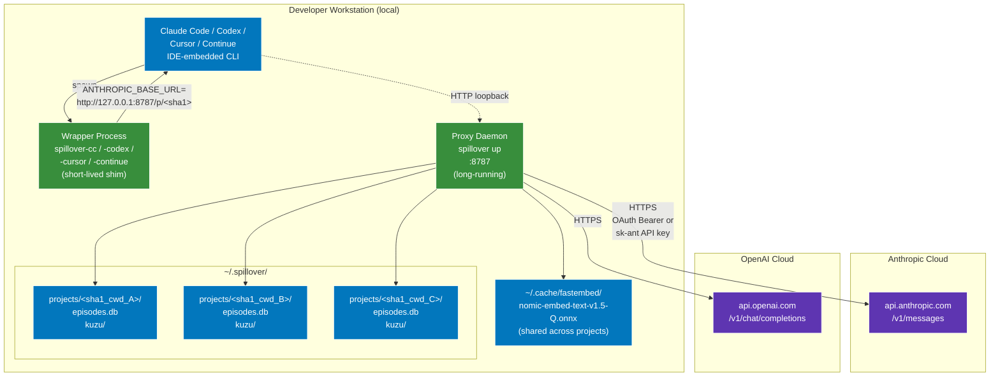

# 11 — Deployment topology

Spillover is a workstation-local system. The entire memory layer runs on the developer's machine; the only cloud dependencies are the LLM provider APIs themselves.



## Process lifetimes

| process | lifetime | start command |
|---|---|---|
| Proxy Daemon | long-running, one per workstation | `spillover up` (foreground) or `nohup spillover up &` (background) |
| Wrapper | short — spawns target CLI then waits | `spillover-cc`, `spillover-codex`, etc |
| Target CLI | as long as the developer needs it | spawned by wrapper, inherits env |

## Filesystem layout

```
~/.spillover/
└── projects/
    ├── 3f7a9c…  (cwd: ~/projects/web-app)
    │   ├── episodes.db
    │   └── kuzu/
    ├── 8b2e44…  (cwd: ~/projects/data-pipeline)
    │   ├── episodes.db
    │   └── kuzu/
    └── …

~/.cache/fastembed/
└── nomic-embed-text-v1.5-Q.onnx   (~130 MB, shared)
```

## Port + network

- Proxy listens on `127.0.0.1:8787` by default (loopback only — never exposed to the network).
- Outbound HTTPS to `api.anthropic.com` and `api.openai.com`.
- No inbound from anything except the developer's own CLIs.

## Auth flow

```
Developer's existing CLI auth (OAuth Bearer or sk-ant- API key)
       ↓
Wrapper sets ANTHROPIC_BASE_URL, leaves Authorization header alone
       ↓
CLI makes request with Authorization: Bearer <token>
       ↓
Proxy forwards the header verbatim to Anthropic/OpenAI
```

Spillover never sees or stores the API key beyond the request lifetime. Header logging is redacted via `spillover.logging.redact()`.

## Resource budget (per workstation)

| resource | typical |
|---|---|
| Memory (proxy) | ~200 MB (FastAPI + asyncio + fastembed loaded) |
| Memory (per project DB) | ~5 MB resident |
| Disk (projects) | linear with archives — ~100 KB per archived turn typical |
| Disk (fastembed cache) | ~130 MB one-time |
| CPU | idle most of the time; spikes during embed (~50 ms per turn on CPU, faster on GPU) |
| Network | passthrough; no extra latency beyond proxy parsing (~50 ms typical) |

## Scaling beyond one workstation

Current shape is single-machine. Multi-tenant SaaS deployment would require:

1. Consolidating per-project SQLite files into a tenant-scoped DB (schema already carries `project_id`).
2. Moving fastembed inference to a shared service (or accepting per-tenant cold start).
3. Replacing the `loopback only` binding with a proper auth gateway.
4. Adding rate limits per tenant (today: none; relies on Anthropic's rate limits transitively).

See `docs/superpowers/plans/` for the candidate roadmap items.

## Failure isolation

| failure | blast radius |
|---|---|
| One project DB corrupted | only that project; others untouched |
| Proxy crash | all active CLIs see connection refused until restart; no data loss (SQLite WAL durable) |
| Fastembed model corrupted | retrieval degrades gracefully (LTM block becomes empty); proxy still forwards |
| Anthropic outage | proxy returns 5xx after retry; eviction skipped for that turn |

## Observability stack

- Logs: stderr in structured Python `logging` format, with header redaction.
- Metrics: `GET http://127.0.0.1:8787/metrics` (Prometheus text format).
- Health: `GET http://127.0.0.1:8787/health` → `{"status": "ok", "version": "1.6.1"}`.
- CLI: `spillover stats <project>` → episodes / evicted / pinned / embedded / facet_pending counts.

No external dependency required for any of these.
