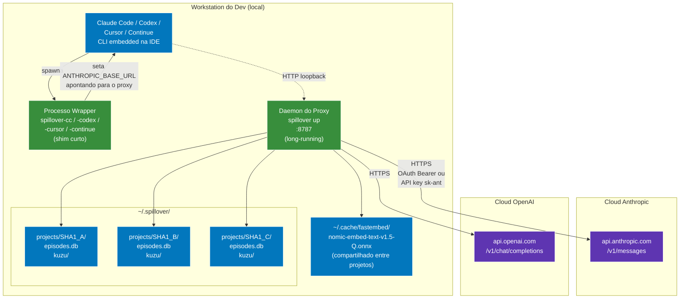

# 11 — Topologia de Deploy

spillover e um sistema workstation-local. Toda a camada de memoria roda na maquina do dev; as unicas dependencias de cloud sao as APIs dos providers LLM em si.



## Tempos de vida dos processos

| processo | tempo de vida | comando de start |
|---|---|---|
| Daemon do Proxy | long-running, um por workstation | `spillover up` (foreground) ou `nohup spillover up &` (background) |
| Wrapper | curto — spawna o CLI alvo entao espera | `spillover-cc`, `spillover-codex`, etc |
| CLI alvo | enquanto o dev precisar | spawned pelo wrapper, herda env |

## Layout do filesystem

```
~/.spillover/
└── projects/
    ├── 3f7a9c…  (cwd: ~/projects/web-app)
    │   ├── episodes.db
    │   └── kuzu/
    ├── 8b2e44…  (cwd: ~/projects/data-pipeline)
    │   ├── episodes.db
    │   └── kuzu/
    └── …

~/.cache/fastembed/
└── nomic-embed-text-v1.5-Q.onnx   (~130 MB, compartilhado)
```

## Porta + rede

- Proxy escuta em `127.0.0.1:8787` por default (loopback soh — nunca exposto na rede).
- HTTPS outbound pra `api.anthropic.com` e `api.openai.com`.
- Sem inbound de nada exceto os CLIs do proprio dev.

## Fluxo de auth

```
Auth existente do CLI do dev (Bearer OAuth ou API key sk-ant-)
       ↓
Wrapper seta ANTHROPIC_BASE_URL, deixa o header Authorization sozinho
       ↓
CLI faz request com Authorization: Bearer <token>
       ↓
Proxy encaminha o header verbatim pra Anthropic/OpenAI
```

spillover nunca ve ou armazena a API key alem do tempo de vida da request. Logging de header e redacted via `spillover.logging.redact()`.

## Budget de recurso (por workstation)

| recurso | tipico |
|---|---|
| Memoria (proxy) | ~200 MB (FastAPI + asyncio + fastembed carregado) |
| Memoria (por DB de projeto) | ~5 MB residente |
| Disco (projetos) | linear nos archives — ~100 KB por turno arquivado tipico |
| Disco (cache fastembed) | ~130 MB uma vez |
| CPU | idle a maior parte do tempo; spikes durante embed (~50 ms por turno em CPU, mais rapido em GPU) |
| Rede | passthrough; sem latencia extra alem do parse do proxy (~50 ms tipico) |

## Escalando alem de uma workstation

Forma atual e single-machine. Deploy multi-tenant SaaS exigiria:

1. Consolidar arquivos SQLite por-projeto num DB escopado por tenant (schema ja carrega `project_id`).
2. Mover inferencia fastembed pra servico compartilhado (ou aceitar cold start por tenant).
3. Trocar o binding `loopback only` por um gateway de auth proper.
4. Adicionar rate limits por tenant (hoje: nenhum; depende dos rate limits da Anthropic transitivamente).

Ver `docs/superpowers/plans/` pra itens candidatos no roadmap.

## Isolamento de falha

| falha | blast radius |
|---|---|
| DB de um projeto corrompido | so esse projeto; outros intocados |
| Crash do proxy | todos CLIs ativos veem connection refused ate restart; sem perda de dado (SQLite WAL durable) |
| Modelo fastembed corrompido | retrieval degrada gracefully (LTM block vira vazio); proxy ainda encaminha |
| Outage da Anthropic | proxy retorna 5xx depois de retry; eviction skippado naquele turno |

## Stack de observabilidade

- Logs: stderr em formato `logging` Python estruturado, com header redaction.
- Metricas: `GET http://127.0.0.1:8787/metrics` (formato texto Prometheus).
- Health: `GET http://127.0.0.1:8787/health` → `{"status": "ok", "version": "1.6.1"}`.
- CLI: `spillover stats <project>` → contadores episodes / evicted / pinned / embedded / facet_pending.

Nenhuma dependencia externa necessaria pra nenhum disso.
