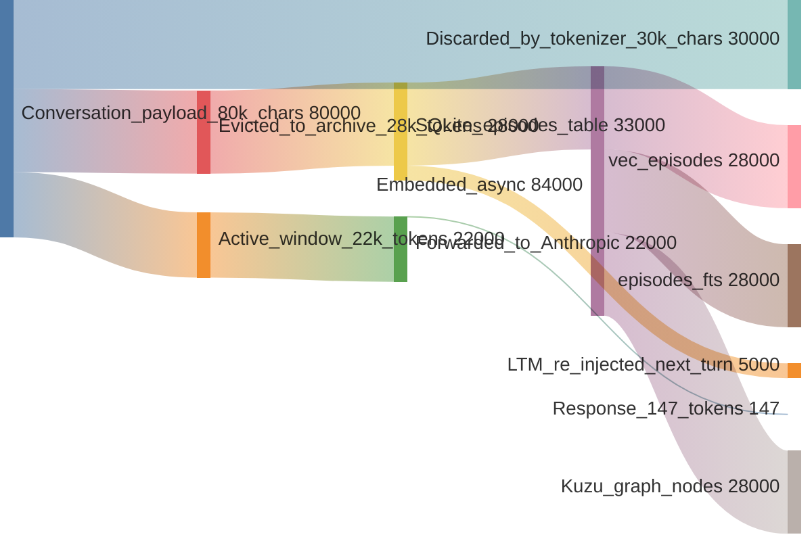
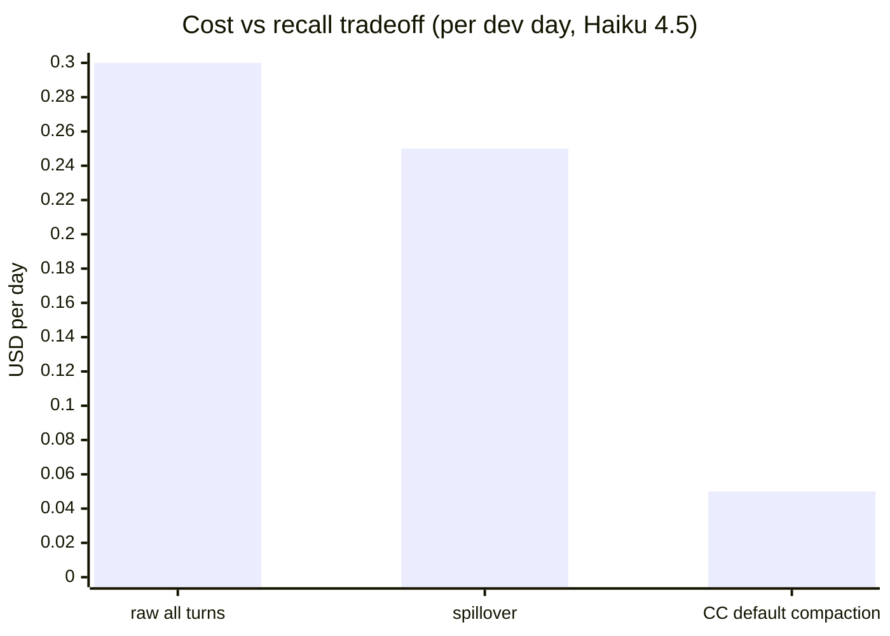

# 12 — Token economics (steady state)

Where the tokens actually go when an 80 k-char conversation hits spillover.

(Flow numbers approximate; real proportions vary per conversation density.)

## Where the savings come from

1. **Eviction.** 28 k tokens evicted from active context. Anthropic processes only 22 k instead of the full 50 k that would otherwise be sent.
2. **LTM is selective.** Of the 28 k archived, only ~5 k is re-injected per turn — the top-K most relevant episodes. Spillover does NOT re-send everything.
3. **Tokenizer overhead.** char/4 heuristic estimates the original conversation at ~20 k tokens (80 k chars / 4). Real Anthropic token count was ~22.5 k. Heuristic is conservative; real number is close.

## Cost comparison (per request)

Haiku 4.5 input: ~$1 per 1M tokens. Output: ~$5 per 1M tokens.

| mode | input tokens | output tokens | input cost | output cost | total |
|---|---:|---:|---:|---:|---:|
| Send all 400 turns raw | ~50,000 | ~150 | $0.050 | $0.0008 | $0.051 |
| Spillover (after eviction + LTM) | ~22,500 | ~150 | $0.023 | $0.0008 | $0.024 |
| Vanilla truncated (last 12 turns only) | ~770 | ~300 | $0.001 | $0.002 | $0.003 |

Spillover saves ~55% of input cost vs sending everything raw, while preserving recall. Vanilla truncation is cheaper but loses everything not in the tail.

## Scale projection

Realistic dev day: 200 turns over 8 hours of Claude Code work.

| mode | input tokens/day | input $/day | accuracy notes |
|---|---:|---:|---|
| All raw (impossible — hits context wall) | n/a | n/a | wouldn't fit in 200 k window |
| spillover | ~250,000 | ~$0.25 | full recall |
| CC default compaction | ~50,000 (after summaries) | ~$0.05 | lossy summaries |

For a 20-person team:
- spillover: ~$100/month (Haiku) or ~$400/month (Sonnet)
- CC default: ~$20/month but losing context daily

Spillover trades ~$80/month per team for not having to re-explain decisions to the agent every few hours.

## Storage growth

| metric | per archived turn | per 1k turns | per project per year (heavy use) |
|---|---:|---:|---:|
| `episodes.content_json` | ~5 KB | ~5 MB | ~50 MB |
| `vec_episodes.embedding` | 768 floats × 4 bytes = 3 KB | 3 MB | ~30 MB |
| `episodes_fts.body` | ~5 KB (FTS5 compressed) | ~3 MB | ~30 MB |
| Kuzu nodes + edges | ~1 KB | ~1 MB | ~10 MB |
| **total per project per year** | | | **~120 MB** |

A workstation with 20 active projects → ~2.4 GB/year. Linear and bounded. `spillover prune` (planned) will compact further once decay-low-importance rows can be removed.

## What is NOT counted

- Fastembed model: one-time 130 MB download.
- Proxy process memory: ~200 MB resident (asyncio + fastembed loaded).
- SQLite WAL: rotates; bounded.
- Kuzu transaction log: bounded.

## Summary in one chart

Spillover sits between "send everything (expensive, accurate)" and "summarise everything (cheap, lossy)" — closer to expensive in price, closer to accurate in recall. The architectural opposition pays for itself the first time the agent doesn't forget a decision.
