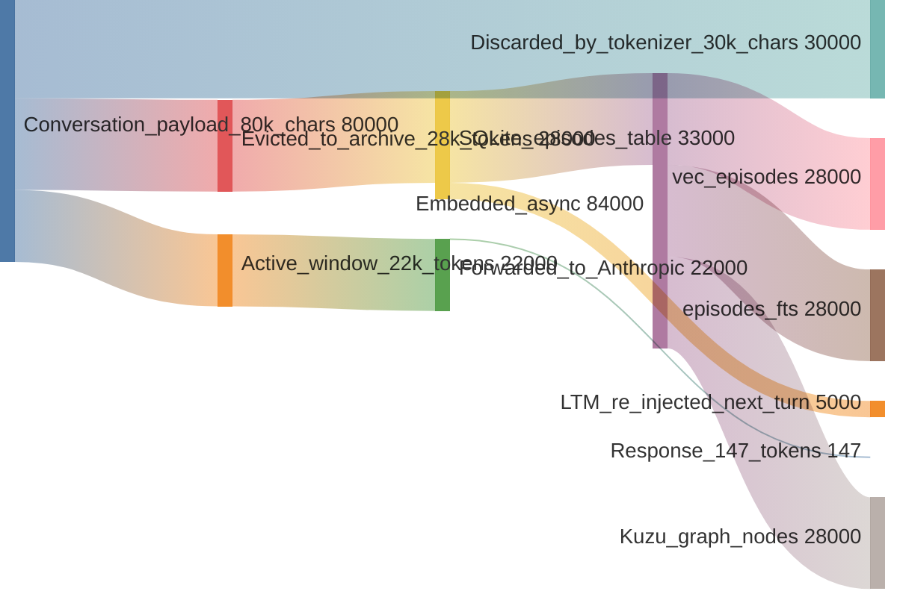
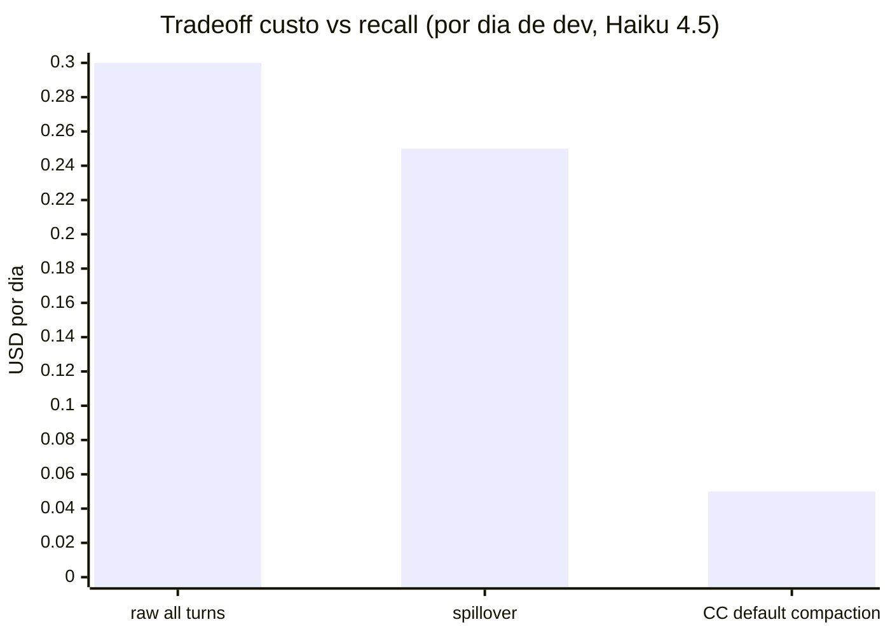

# 12 — Economia de tokens (steady state)

Pra onde os tokens realmente vao quando uma conversa de 80 k chars bate no spillover.

(Numeros aproximados; proporcoes reais variam por densidade da conversa.)

## De onde vem a economia

1. **Eviction.** 28 k tokens evicted do contexto ativo. Anthropic processa soh 22 k em vez dos 50 k que seriam enviados se tudo fosse cru.
2. **LTM e seletiva.** Dos 28 k arquivados, soh ~5 k sao reinjetados por turno — os top-K episodios mais relevantes. spillover NAO reenviam tudo.
3. **Overhead do tokenizer.** Heuristica char/4 estima a conversa original em ~20 k tokens (80 k chars / 4). Contador real Anthropic foi ~22.5 k. Heuristica e conservadora; numero real e proximo.

## Comparacao de custo (por request)

Haiku 4.5 input: ~$1 por 1M tokens. Output: ~$5 por 1M tokens.

| modo | input tokens | output tokens | input cost | output cost | total |
|---|---:|---:|---:|---:|---:|
| Mandar 400 turnos crus | ~50,000 | ~150 | $0.050 | $0.0008 | $0.051 |
| Spillover (apos eviction + LTM) | ~22,500 | ~150 | $0.023 | $0.0008 | $0.024 |
| Vanilla truncado (so 12 ultimos turnos) | ~770 | ~300 | $0.001 | $0.002 | $0.003 |

spillover economiza ~55% do custo de input vs mandar tudo cru, preservando o recall. Truncacao vanilla e mais barata mas perde tudo que nao esta no tail.

## Projecao de escala

Dia de dev realistico: 200 turnos em 8 horas de trabalho com Claude Code.

| modo | input tokens/dia | input $/dia | notas de accuracy |
|---|---:|---:|---|
| Tudo cru (impossivel — bate no muro do contexto) | n/a | n/a | nao cabe na janela de 200 k |
| spillover | ~250,000 | ~$0.25 | recall completo |
| CC default compaction | ~50,000 (apos summaries) | ~$0.05 | summaries lossy |

Pra time de 20 pessoas:
- spillover: ~$100/mes (Haiku) ou ~$400/mes (Sonnet)
- CC default: ~$20/mes mas perdendo contexto diariamente

spillover troca ~$80/mes por time pra nao ter que re-explicar decisoes pro agente a cada poucas horas.

## Crescimento do storage

| metrica | por turno arquivado | por 1k turnos | por projeto por ano (uso pesado) |
|---|---:|---:|---:|
| `episodes.content_json` | ~5 KB | ~5 MB | ~50 MB |
| `vec_episodes.embedding` | 768 floats × 4 bytes = 3 KB | 3 MB | ~30 MB |
| `episodes_fts.body` | ~5 KB (FTS5 comprimido) | ~3 MB | ~30 MB |
| Kuzu nodes + edges | ~1 KB | ~1 MB | ~10 MB |
| **total por projeto por ano** | | | **~120 MB** |

Workstation com 20 projetos ativos → ~2.4 GB/ano. Linear e bounded. `spillover prune` (planejado) vai compactar mais ainda quando linhas com decay-low-importance puderem ser removidas.

## O que NAO esta contado

- Modelo fastembed: download de 130 MB uma vez.
- Memoria do processo do proxy: ~200 MB residente (asyncio + fastembed carregado).
- WAL do SQLite: rotaciona; bounded.
- Log de transacao do Kuzu: bounded.

## Resumo num grafico

spillover fica entre "mandar tudo (caro, accurate)" e "resumir tudo (barato, lossy)" — mais perto de caro no preco, mais perto de accurate no recall. A oposicao arquitetural se paga na primeira vez que o agente nao esquece uma decisao.
